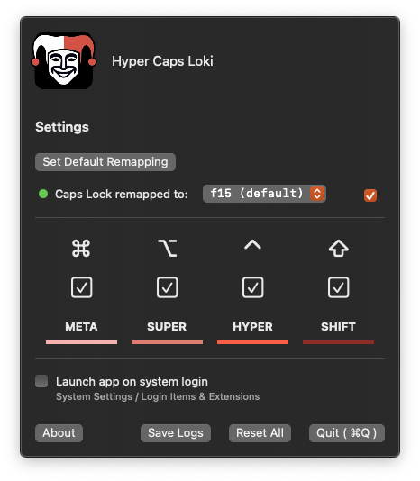
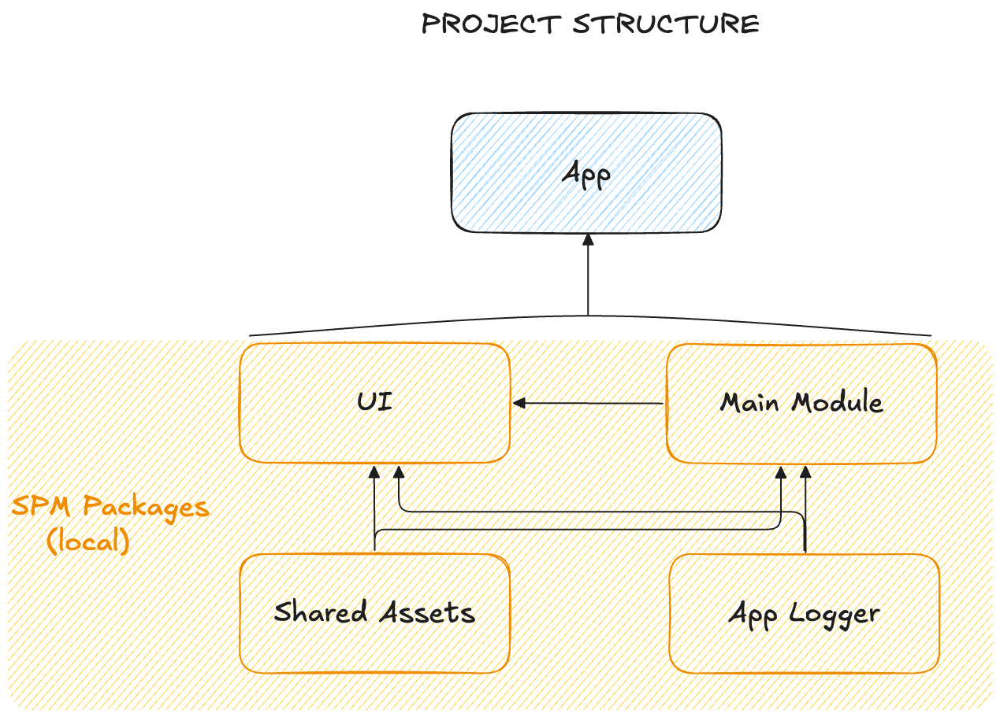
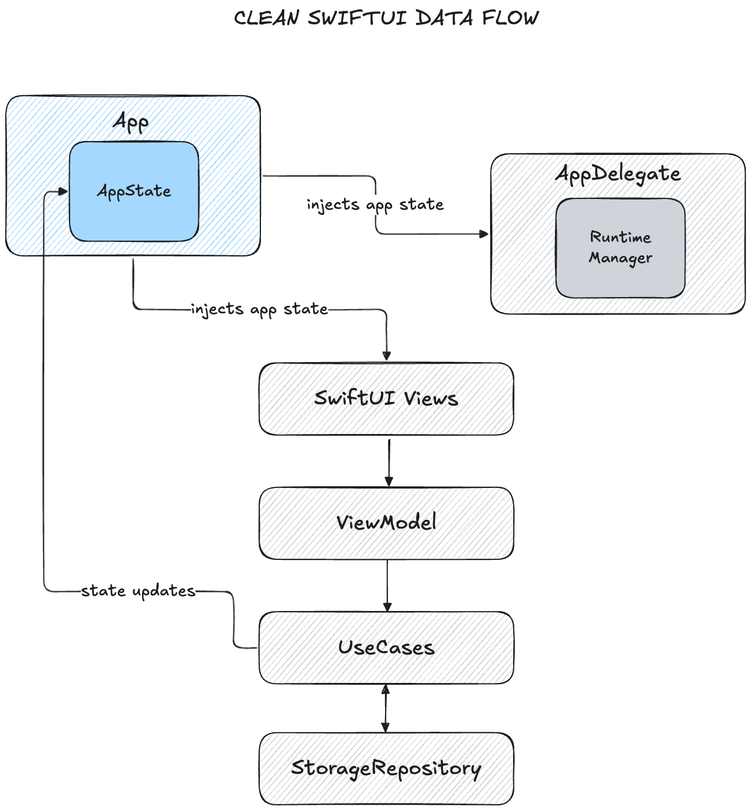
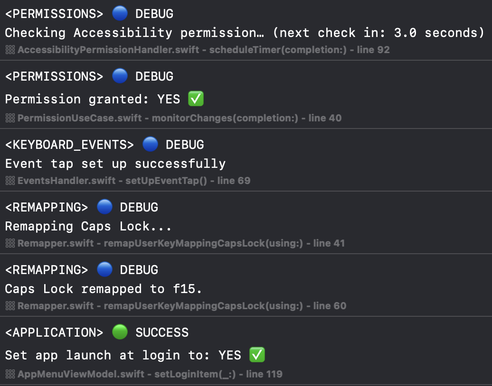

# HyperCapsLoki – A Native macOS Hyper Key Remapper

**Swift**: built with the latest Swift 6  
**Strict Concurrency Checking**: complete  
**License**: MIT  
**Integrity**: ✅ Verified with MD5A checksum  
**Build**: 100% Xcode compatible – no external tools  
**Tested on**: `MacbookPro (with Touch Bar)` keyboard, `Logitec MX Keys Mini` keyboard

---

## What is HyperCapsLoki?

HyperCapsLoki remaps your **Caps Lock** key into a powerful **Hyper Key** – a combination of:

- ⌘ **Command** (META)  
- ⌥ **Option**  (SUPER)  
- ⌃ **Control** (HYPER)  
- ⇧ **Shift**   (SHIFT)

This combo is triggered **only when Caps Lock is held down together with another key** 

- for example: `Caps Lock + h` or `Caps Lock + Space`.

If you just tap and release Caps Lock like usual, it behaves as the standard Caps Lock key — nothing changes.  

### Features

- 🧑‍💻 **Open Source** – no secrets here.
- 🖥️ **Fully Native** – written entirely in Swift with SwiftUI.
- 🧼 **No Third-Party Libraries** – zero dependencies.
- 🛠️ **Customizable** – configure which modifier keys are active.
- 🏃 **Auto-Launch** – start at login, silently.
- 📋 **Anonymous Diagnostic Logs** – logging for debugging with option to save logs in a file.

---

## Installation

You can get started in two ways:

- ✅ **Download the [release version]()** and run it like any other macOS app.
(You can verify the app with MD5A checksum for integrity)
- 🛠️ **Build it yourself** using Xcode – just clone this repo and hit Run.

No extra tools. No setup headaches.

## Permissions & Accessibility

To capture key events, the app uses **macOS Accessibility APIs**. When launched, it:

- Checks whether it has permission.
- Prompts you to allow access if not granted - just plain macOS requirements.

**Monitoring service** tracks the permission state and updates the UI reactively.

> _Why?_ macOS restricts apps from monitoring keyboard input unless explicitly allowed, to protect user privacy.

---

## App Architecture

HyperCapsLoki is designed with maintainability and clarity in mind.
 

    
<b>Project Structure</b>

The project follows a clean separation between App, UI, business logic, and logging layers.
It consists of four separate Swift Package Manager (SPM) modules.

This modular approach was chosen to solve an issue where running unit tests would trigger the full app launch,
even when the tests didn’t interact with the app's @main entry point. Splitting the logic into distinct modules allowed
isolated testing without invoking the entire app lifecycle.

    
<b>Clean SwiftUI Data Flow</b>

- `AppState` is the central environment object that contains the app’s global state and dependencies.
It is instantiated in the `App` entry point and passed down to both the `AppDelegate` and SwiftUI `Views`.

- **Views** interact with `ViewModels`, which in turn trigger domain-level `UseCases`.
Each **UseCase** encapsulates a specific action and its required dependencies.

- For persistence, `UseCases` rely on a `StorageRepository` abstraction, with a concrete implementation using `UserDefaults`.

- `Views` subscribe to state changes in `AppState` and automatically update when actions (from `UseCases`) modify the state.

---

## ⌨️ Key Events and Mappings

#### Core Behavior

- Single Press = Caps Lock Toggle
When the configured Hyperkey is pressed and released alone, it toggles the Caps Lock state. 
This is useful for users who still want traditional Caps Lock functionality.

- Hyperkey + Another Key = Modifier Combo
If the Hyperkey is held and another key is pressed, it no longer toggles Caps Lock. 
Instead, it acts as a simultaneous combination of:
⌘ Command
⌥ Option
⌃ Control
⇧ Shift
This allows you to use one key to unlock powerful shortcut combinations.

#### 🧬 How It Works Under the Hood

1. **CGEvent Tap Monitoring** 

   All keyboard events are intercepted using a `CGEventTap`. This captures `keyDown`, `keyUp`, and `flagsChanged` 
events before the system processes them.

2. **Timer-Based Caps Lock Trigger**

   When the Hyperkey is pressed, a 1.5-second timer is started. If no other key is pressed during that time, the system
interprets the action as a Caps Lock toggle. If another key is detected, Caps Lock toggle is canceled, and the 
Hyperkey acts as a modifier.

3. **Carbon Key Code Mapping** 

   Each key is first identified by its HID usage code, then mapped to its **Carbon** `CGKeyCode`, ensuring compatibility 
with macOS system-level key handling APIs. This guarantees precise control over low-level key behavior.

4. **Event Flag Injection**

   When the Hyperkey is held, a predefined **sequence of modifier flags** (like `.maskCommand`, `.maskControl`, etc.)
is injected into the system using a custom `SystemEventsInjection` service. This simulates pressing all modifiers at once.

5. **Caps Lock Toggle via IOHID**

   The actual toggle of Caps Lock is done by querying and updating the system’s internal `IOHIDSystem` using
the `IOHIDGetModifierLockState` and `IOHIDSetModifierLockState` APIs. This allows for a reliable, 
hardware-level toggle of the Caps Lock state.

---

## Diagnostic Logging

The app logs diagnostic events **anonymously** to help troubleshoot issues:

- Logs only capture behavior related to the app (e.g., remapping failures, event dispatch status).
- No personally identifiable data is ever stored or transmitted.

- You can easily inspect, filter, or save logs.

---

## Motivation

HyperCapsLoki started as a playground for:

- 🍏 Building my first real-world **macOS utility** app from scratch
- 🧱 Implementing a full **Clean SwiftUI** architecture
- 🧪 Exploring the new **Swift Testing Framework**
- 💬  Giving back to the macOS dev community with a tool that prioritizes transparency, and usefulness.

When building something that intercepts keyboard events, there's no room for ambiguity — the only way to earn full trust is to make the code open and inspectable.

That principle was the foundation of HyperCapsLoki: no hidden behavior, no third-party code — just a clean, native solution you can verify yourself.

---

## 🤝 Contribute

Ideas, issues, or improvements? PRs welcome.  
Open discussions if you have questions or suggestions!

---

## 📄 License

MIT – free to use, fork, and improve.
